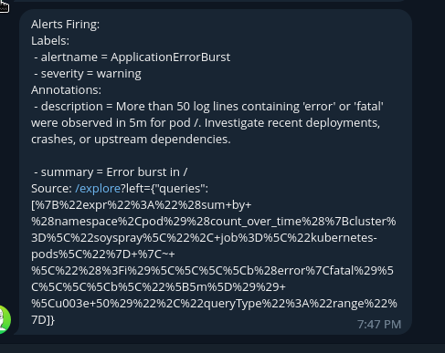

# Test 4: ApplicationErrorBurst Alert End-to-End Verification

## Overview

This test verifies the complete alert pipeline from log generation to Telegram notification for the ApplicationErrorBurst alert rule.

## Prerequisites

Ensure Alloy has correct RBAC permissions to read pod logs:

```bash
kubectl describe clusterrole alloy | grep -A 10 "Resources"
```

Expected output should include:

```
Resources                        Non-Resource URLs  Resource Names  Verbs
---------                        -----------------  --------------  -----
pods                             []                 []              [get list watch]
pods/log                         []                 []              [get list watch]
```

If pods/log is missing, fix RBAC in playbooks/yaml/argocd-apps/loki/alloy-rbac.yaml and sync the app.

## Step 1: Start Port-Forward to Loki

```bash
cd /home/boris/code/soyspray
kubectl port-forward -n monitoring svc/loki 3100:3100 &
sleep 2
```

## Step 2: Create Error-Generating Test Pod

```bash
kubectl run error-test-$(date +%s) \
  --image=busybox \
  --restart=Never \
  --namespace=default \
  --labels="test=loki-alert" \
  -- sh -c 'for i in $(seq 1 100); do echo "ERROR: Test error message number $i"; sleep 1; done'
```

Check pod is running:

```bash
kubectl get pod -n default -l test=loki-alert
```

Expected output:

```
NAME                    READY   STATUS    RESTARTS   AGE
error-test-1760597109   1/1     Running   0          8s
```

## Step 3: Verify Pod Logs Are Being Generated

```bash
kubectl logs -n default error-test-<pod-id> --tail=5
```

Expected output:

```
ERROR: Test error message number 96
ERROR: Test error message number 97
ERROR: Test error message number 98
ERROR: Test error message number 99
ERROR: Test error message number 100
```

## Step 4: Wait for Log Ingestion

```bash
echo "Waiting 30 seconds for logs to be ingested into Loki..."
sleep 30
```

## Step 5: Verify Alloy Collected the Logs

Check Alloy opened a log stream for the test pod:

```bash
kubectl logs -n monitoring alloy-szq2d --since=10m | grep "error-test"
```

Expected output should show:

```
level=info msg="tailer running" target=default/error-test-1760597109:error-test-1760597109
level=info msg="opened log stream" target=default/error-test-1760597109:error-test-1760597109
```

## Step 6: Query Loki for Ingested Logs

Query for ERROR logs from kubernetes-pods job:

```bash
curl -G -s 'http://localhost:3100/loki/api/v1/query_range' \
  --data-urlencode 'query={job="kubernetes-pods"} |= "ERROR"' \
  --data-urlencode 'limit=10' \
  --data-urlencode 'start='$(date -u -d '10 minutes ago' +%s) 2>/dev/null \
  | jq .data.result[0].values[:5]
```

Expected output:

```json
[
  [
    "1760597210985449870",
    "ERROR: Test error message number 100\n"
  ],
  [
    "1760597209982419934",
    "ERROR: Test error message number 99\n"
  ],
  [
    "1760597208980789816",
    "ERROR: Test error message number 98\n"
  ]
]
```

## Step 7: Verify Alert Query Threshold Exceeded

Run the actual alert LogQL query:

```bash
curl -G -s 'http://localhost:3100/loki/api/v1/query' \
  --data-urlencode 'query=sum by (namespace, pod) (count_over_time({job="kubernetes-pods"} |~ "(?i)\\b(error|fatal)\\b" [5m]))' \
  2>/dev/null | jq
```

Expected output should show count greater than 50:

```json
{
  "status": "success",
  "data": {
    "resultType": "vector",
    "result": [
      {
        "metric": {},
        "value": [
          1760597338.661,
          "236"
        ]
      }
    ]
  }
}
```

## Step 8: Wait for Alert to Fire

The alert has a "for: 5m" clause, so it must be true for 5 minutes before firing.

```bash
echo "Waiting 5 minutes for alert to fire..."
sleep 300
```

## Step 9: Check Alertmanager for Active Alert

Start port-forward to Alertmanager:

```bash
kubectl port-forward -n monitoring svc/alertmanager-operated 9093:9093 &
sleep 2
```

Query for ApplicationErrorBurst alert:

```bash
curl -s 'http://localhost:9093/api/v2/alerts' 2>/dev/null \
  | jq '.[] | select(.labels.alertname=="ApplicationErrorBurst")'
```

Expected output:

```json
{
  "annotations": {
    "description": "More than 50 log lines containing 'error' or 'fatal' were observed in 5m for pod /. Investigate recent deployments, crashes, or upstream dependencies.\n",
    "summary": "Error burst in /"
  },
  "endsAt": "2025-10-16T06:52:49.246Z",
  "fingerprint": "105d7eb62b5aa845",
  "receivers": [
    {
      "name": "telegram"
    }
  ],
  "startsAt": "2025-10-16T06:46:49.246Z",
  "status": {
    "inhibitedBy": [],
    "mutedBy": [],
    "silencedBy": [],
    "state": "active"
  },
  "labels": {
    "alertname": "ApplicationErrorBurst",
    "severity": "warning"
  }
}
```

## Step 10: Verify Telegram Notification

Check your Telegram app for chat ID 336642153.

Expected message format:

```
[FIRING:1] ApplicationErrorBurst

Error burst in /

More than 50 log lines containing 'error' or 'fatal' were observed in 5m for pod /. Investigate recent deployments, crashes, or upstream dependencies.

Labels:
  alertname: ApplicationErrorBurst
  severity: warning
```



## Step 11: Cleanup

Stop port-forwards:

```bash
pkill -f 'port-forward.*loki'
pkill -f 'port-forward.*alertmanager'
```

Delete test pods:

```bash
kubectl delete pod -n default -l test=loki-alert
```

Verify cleanup:

```bash
kubectl get pod -n default -l test=loki-alert
```

Expected output:

```
No resources found in default namespace.
```

## Success Criteria

Test passes if all of the following are true:

```
1. Error-test pod created and logged 100 ERROR lines
2. Alloy opened log stream for test pod
3. Loki ingested logs (query returns ERROR lines)
4. Alert query shows count greater than 50
5. Alert appears in Alertmanager after 5 minutes
6. Alert status is "active"
7. Alert receiver is "telegram"
8. Telegram notification received in chat 336642153
```

## Common Issues

### Issue: Alloy shows "forbidden" errors for pods/log

Fix: Add pods/log permission to alloy ClusterRole in alloy-rbac.yaml

```yaml
rules:
  - apiGroups: [""]
    resources:
      - pods
      - pods/log
    verbs: ["get", "list", "watch"]
```

Then sync the loki app:

```bash
argocd app sync loki
```

### Issue: No logs in Loki

Check Alloy is collecting logs:

```bash
kubectl logs -n monitoring daemonset/alloy --tail=50
```

Check Loki is receiving data:

```bash
kubectl logs -n monitoring loki-0 --tail=50 | grep ingester
```

### Issue: Alert not firing after 5 minutes

Check Loki ruler logs:

```bash
kubectl logs -n monitoring loki-0 | grep ruler
```

Check rules are loaded:

```bash
curl -s 'http://localhost:3100/loki/api/v1/rules'
```

## Test Completion Time

Total test duration: approximately 8 minutes

```
- Pod creation: 1 minute (logs 100 lines at 1/sec)
- Log ingestion delay: 30 seconds
- Alert "for" duration: 5 minutes
- Verification: 1-2 minutes
```

