# ExternalDNS

ExternalDNS watches Kubernetes Ingress resources and automatically creates DNS records in Cloudflare.

## How it Works

```mermaid
graph LR
    A[Ingress<br/>grafana.soyspray.vip] -->|watches| B[ExternalDNS]
    B -->|creates record| C[Cloudflare DNS<br/>grafana.soyspray.vip → Azure VPS]
```



## Purpose

1. **DNS Automation**: Automatic DNS record creation for Ingress resources
2. **Certificate Validation**: DNS records required for Let's Encrypt domain ownership verification

## Network Setup

- Public access through Azure VPS with Wireguard tunnel
- Local ingress (192.168.1.120) accessible only through VPN
- PiHole DNS (192.168.1.122) handles local name resolution

## Debug Commands

```bash
# Check running pods
kubectl -n external-dns get pods

# View controller logs
kubectl -n external-dns logs -l app.kubernetes.io/name=external-dns
```
