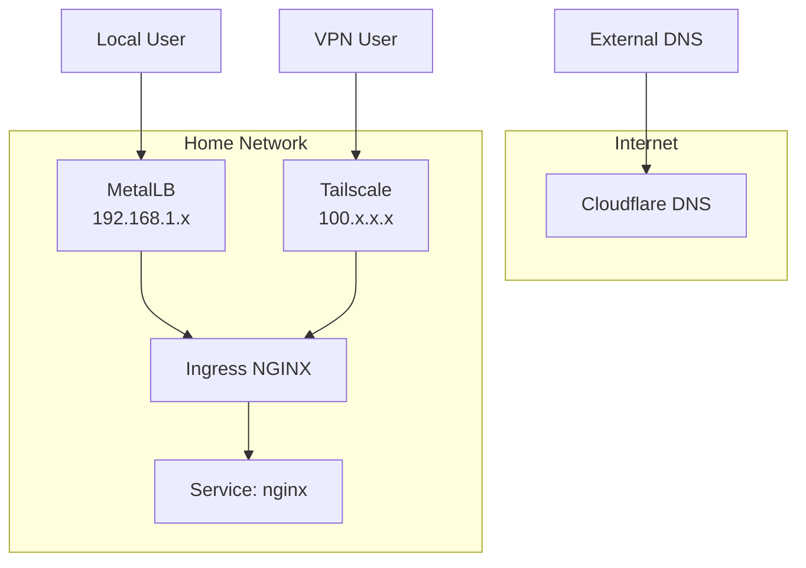
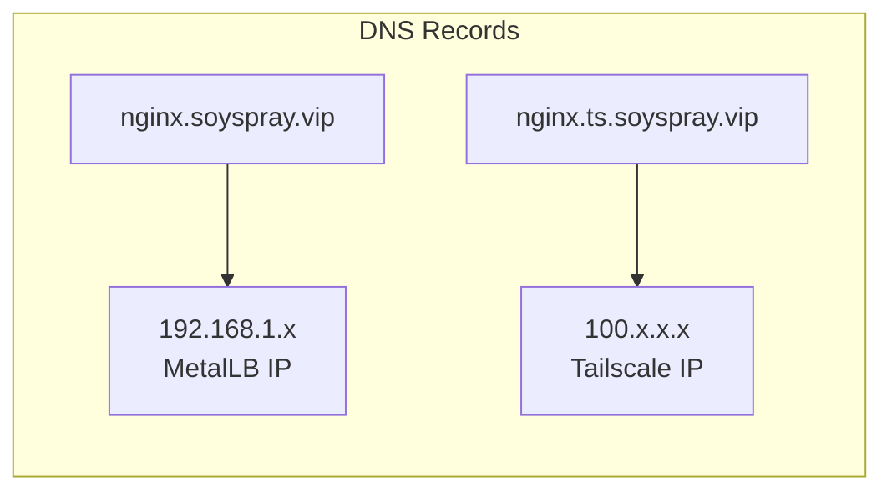
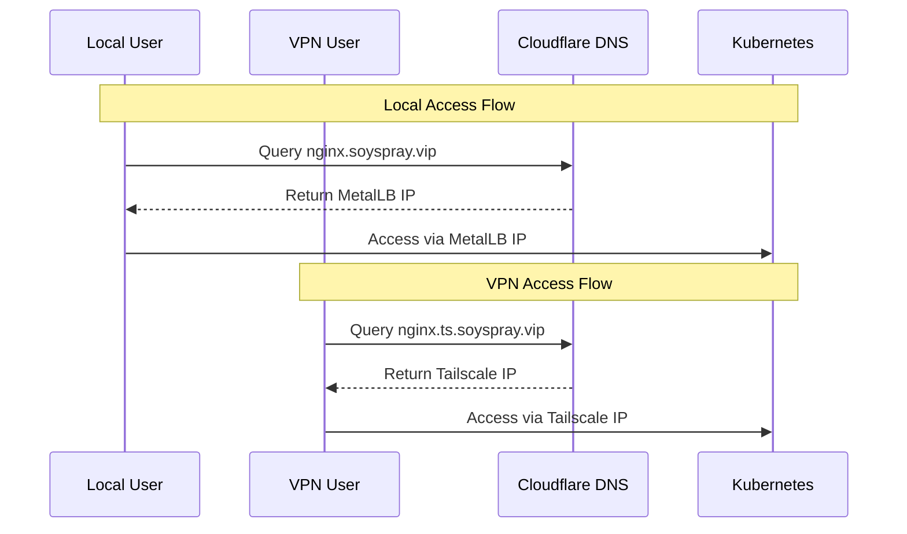

# Dual Domain Access: Local and VPN

This document explains how the cluster services are accessible both locally and over Tailscale VPN.

## Architecture Overview



## DNS Strategy

We use dual A records for each service:
- `service.soyspray.vip` → MetalLB IP (local access)
- `service.ts.soyspray.vip` → Tailscale IP (VPN access)

Example for nginx:


## Components

1. **Ingress NGINX**:
   - Handles both local and VPN traffic
   - TLS termination with Let's Encrypt certificates

2. **MetalLB**:
   - Provides local LoadBalancer IPs
   - Used for direct home network access

3. **Tailscale**:
   - Provides VPN LoadBalancer IPs
   - Enables secure remote access

4. **External DNS**:
   - Automatically manages DNS records in Cloudflare
   - Handles both MetalLB and Tailscale IPs

## Service Configuration

For each service that needs dual access:

1. Create two ingress resources:
   ```yaml
   # Local access
   - host: service.soyspray.vip
     service: service-name

   # VPN access
   - host: service.ts.soyspray.vip
     service: service-name
   ```

2. Add required annotations:
   ```yaml
   # For Tailscale
   tailscale.com/funnel: "true"
   external-dns.alpha.kubernetes.io/target: "100.x.x.x"

   # For certificates
   cert-manager.io/cluster-issuer: letsencrypt-prod
   ```

## Access Flow



## Testing Access

1. Local network:
   ```bash
   curl https://nginx.soyspray.vip
   ```

2. Over VPN:
   ```bash
   curl https://nginx.ts.soyspray.vip
   ```

Both should return the same content, just routed differently.
