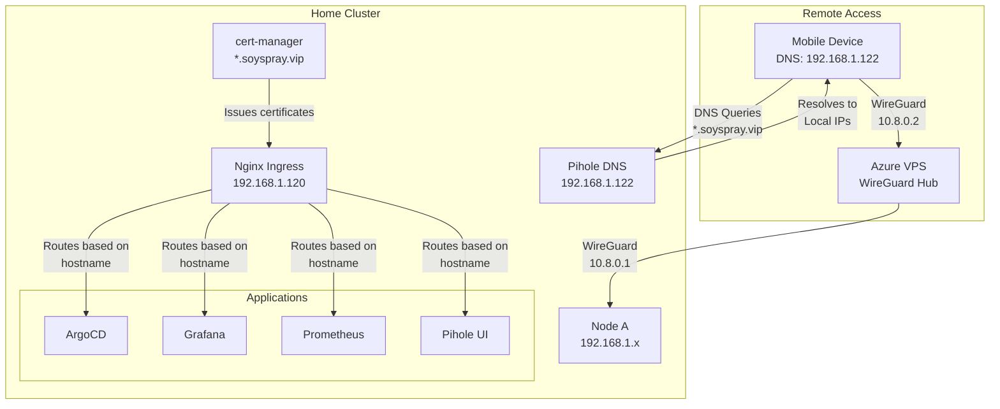

# Configuring Domain-Based Access with Ingress

## Table of Contents

- [Overview](#overview)
- [System Architecture](#system-architecture)
- [Quick Start](#quick-start)
- [Prerequisites](#prerequisites)
- [Implementation Steps](#implementation-steps)
  - [1. Verify Components](#1-verify-components)
  - [2. Configure TLS Certificates](#2-configure-tls-certificates)
  - [3. Configure DNS Resolution](#3-configure-dns-resolution)
  - [4. Create Ingress Resources](#4-create-ingress-resources)
  - [5. Test Access](#5-test-access)
- [Troubleshooting](#troubleshooting)

## Overview

This guide describes how to configure your cluster services to be accessible via domain names through WireGuard using valid TLS certificates. Services will be accessible through domains like:

- argocd.soyspray.vip
- grafana.soyspray.vip
- prometheus.soyspray.vip
- pihole.soyspray.vip

The setup uses:
- Local Pihole DNS resolution for `.soyspray.vip` domains
- Valid TLS certificates for HTTPS access
- WireGuard for secure remote access
- No external DNS or port forwarding required

## System Architecture



## Quick Start

1. Ensure prerequisites are met (WireGuard, Nginx Ingress, cert-manager, Pihole)
2. Configure wildcard TLS certificate for `*.soyspray.vip`
3. Configure Pihole DNS entries for `.soyspray.vip` domains
4. Create ingress resources with TLS
5. Configure WireGuard clients to use Pihole DNS (192.168.1.122)

## Prerequisites

- Working Kubernetes cluster with:
  - Nginx Ingress Controller
  - cert-manager
  - Pihole
  - WireGuard VPN hub (Azure VPS)

## Implementation Steps

### 1. Verify Components

Ensure all required components are running:
```bash
# Check Nginx Ingress
kubectl get svc -n ingress-nginx

# Check cert-manager
kubectl get pods -n cert-manager

# Check Pihole
kubectl get svc -n pihole
```

### 2. Configure TLS Certificates

Create ClusterIssuer and Certificate for wildcard domain:
```yaml
apiVersion: cert-manager.io/v1
kind: Certificate
metadata:
  name: soyspray-wildcard
spec:
  secretName: soyspray-tls
  dnsNames:
    - "*.soyspray.vip"
  issuerRef:
    name: letsencrypt-prod
    kind: ClusterIssuer
```

### 3. Configure DNS Resolution

Pihole DNS configuration for local resolution:
```yaml
custom.list: |
  192.168.1.123 grafana.soyspray.vip
  192.168.1.122 pihole.soyspray.vip
  192.168.1.121 argocd.soyspray.vip
  # ... other services
```

### 4. Create Ingress Resources

Example ingress configuration:
```yaml
apiVersion: networking.k8s.io/v1
kind: Ingress
metadata:
  name: pihole-web
  annotations:
    cert-manager.io/cluster-issuer: letsencrypt-prod
spec:
  tls:
    - hosts:
        - pihole.soyspray.vip
      secretName: pihole-tls
  rules:
    - host: pihole.soyspray.vip
      http:
        paths:
          - path: /
            pathType: Prefix
            backend:
              service:
                name: pihole-web
                port:
                  number: 80
```

### 5. Test Access

1. **Verify DNS Resolution**:
   ```bash
   # Should resolve to local IP
   nslookup pihole.soyspray.vip 192.168.1.122
   ```

2. **Test HTTPS Access** (over WireGuard):
   ```bash
   # Should show valid HTTPS certificate
   curl -v https://pihole.soyspray.vip
   ```

## Troubleshooting

### DNS Issues
- Verify Pihole DNS entries are correct
- Check WireGuard client DNS configuration
- Ensure WireGuard routing includes 192.168.1.0/24

### Certificate Issues
- Check certificate status with `kubectl get certificates`
- Verify ingress TLS configuration
- Check cert-manager logs

### Access Issues
- Verify WireGuard connection
- Check ingress controller logs
- Ensure service endpoints are correct
