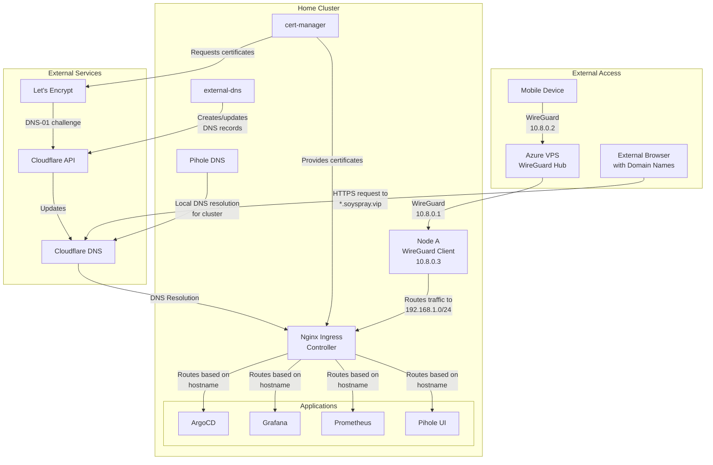

# Configuring Domain-Based Access with Ingress

## Table of Contents

- [Overview](#configuring-domain-based-access-with-ingress)
- [System Architecture](#system-architecture)
- [Quick Start / TLDR](#quick-start--tldr)
- [Certificate Strategy](#certificate-strategy)
  - [Individual vs Wildcard](#individual-vs-wildcard)
  - [Switching to Wildcard](#switching-to-wildcard)
- [Prerequisites](#prerequisites)
- [Implementation Steps](#implementation-steps)
  - [1. Verify Ingress Controller](#1-verify-ingress-controller-is-running)
  - [2. Create ClusterIssuer](#2-create-clusterissuer-for-tls-certificates)
  - [3. Create Ingress Resources](#3-create-ingress-resources-for-services)
  - [4. Configure DNS](#4-configure-dns-with-external-dns)
  - [5. Verify Certificates](#5-verify-certificate-issuance)
  - [6. Test Access](#6-test-access)
- [Troubleshooting](#troubleshooting)
- [Automated Setup](#automated-setup)
- [Next Steps](#next-steps)

This guide describes how to configure your cluster services to be accessible via domain names (with HTTPS) rather than directly by IP addresses. We'll set up access to services through domains like:

- argocd.soyspray.vip
- grafana.soyspray.vip
- prometheus.soyspray.vip
- pihole.soyspray.vip

This configuration will work both from your local network and over WireGuard.

## Quick Start / TLDR

Sequence of actions to implement domain-based access:

1. **Verify prerequisites** - Ensure all components are running (WireGuard, Nginx Ingress, cert-manager, external-dns, etc.)
2. **Create ClusterIssuer** - Set up cert-manager's ClusterIssuer to work with Cloudflare and Let's Encrypt
3. **Create Ingress resources** - Create ingress definitions for each service (ArgoCD, Grafana, Prometheus, Pihole)
4. **Verify DNS records** - Check external-dns logs to confirm records are created in Cloudflare
5. **Verify certificate issuance** - Ensure TLS certificates are correctly issued
6. **Test access** - Access services via domain names from both local network and WireGuard

## Certificate Strategy

### Individual vs Wildcard

The guide currently uses individual certificates for each service (e.g., separate certs for pihole.soyspray.vip, grafana.soyspray.vip). While this provides better security isolation, for home labs a wildcard certificate (*.soyspray.vip) can be simpler to manage.

Individual Certificates:

- ✅ Better security isolation
- ✅ Independent lifecycle
- ❌ More Let's Encrypt API calls
- ❌ More complex management

Wildcard Certificate:

- ✅ Single certificate for all services
- ✅ New subdomains work automatically
- ✅ Simpler management
- ❌ All services affected if compromised

### Switching to Wildcard

To switch from individual to wildcard certificates:

1. **Backup**:
   - Export existing TLS secrets
   - Note down all existing ingress configurations

2. **Create Wildcard Certificate**:
   - Create new ClusterIssuer for *.soyspray.vip
   - Use DNS-01 challenge (required for wildcards)
   - Store certificate in central namespace

3. **Update Ingresses**:
   - Remove cert-manager annotations
   - Point to shared wildcard certificate
   - Update one service at a time
   - Verify each service remains accessible

4. **Cleanup**:
   - Remove old individual certificates
   - Remove old certificate requests
   - Update documentation

5. **Verification**:
   - Test all services
   - Verify certificate renewal
   - Check external-dns synchronization

This migration can be done gradually, testing each service before moving to the next.

## System Architecture


```mermaid
graph TD
    subgraph "External Access"
        Mobile["Mobile Device"]
        VPS["Azure VPS<br>WireGuard Hub"]
        Browser["External Browser<br>with Domain Names"]
    end

    subgraph "Home Cluster"
        NodeA["Node A<br>WireGuard Client<br>10.8.0.3"]
        Ingress["Nginx Ingress<br>Controller"]
        ExtDNS["external-dns"]
        CertMgr["cert-manager"]
        Pihole["Pihole DNS"]

        subgraph "Applications"
            ArgoCD["ArgoCD"]
            Grafana["Grafana"]
            Prometheus["Prometheus"]
            PiholeUI["Pihole UI"]
        end
    end

    subgraph "External Services"
        CloudflareAPI["Cloudflare API"]
        CloudflareDNS["Cloudflare DNS"]
        LetsEncrypt["Let's Encrypt"]
    end

    %% WireGuard connections
    Mobile -- "WireGuard<br>10.8.0.2" --> VPS
    VPS -- "WireGuard<br>10.8.0.1" --> NodeA
    NodeA -- "Routes traffic to<br>192.168.1.0/24" --> Ingress

    %% Browser connections
    Browser -- "HTTPS request to<br>*.soyspray.vip" --> CloudflareDNS
    CloudflareDNS -- "DNS Resolution" --> Ingress

    %% Internal routing
    Ingress -- "Routes based on<br>hostname" --> ArgoCD
    Ingress -- "Routes based on<br>hostname" --> Grafana
    Ingress -- "Routes based on<br>hostname" --> Prometheus
    Ingress -- "Routes based on<br>hostname" --> PiholeUI

    %% DNS management
    ExtDNS -- "Creates/updates<br>DNS records" --> CloudflareAPI
    CloudflareAPI -- "Updates" --> CloudflareDNS

    %% Certificate management
    CertMgr -- "Requests certificates" --> LetsEncrypt
    LetsEncrypt -- "DNS-01 challenge" --> CloudflareAPI
    CertMgr -- "Provides certificates" --> Ingress

    %% Local DNS
    Pihole -- "Local DNS resolution<br>for cluster" --> CloudflareDNS
```

## Prerequisites

Ensure you have the following components already set up:

- A working Kubernetes cluster with Kubespray
- WireGuard for remote access (configured as per the wireguard.yml playbook)
- cert-manager installed and working
- external-dns configured with Cloudflare
- Pihole running
- MetalLB for load balancing
- ArgoCD for deployments
- A domain (e.g., soyspray.vip) configured in Cloudflare

## Implementation Steps

### 1. Verify Ingress Controller is Running

```
# Check if Nginx Ingress pods are running
kubectl get pods -n ingress-nginx
```

### 2. Create ClusterIssuer for TLS Certificates

```
# Create ClusterIssuer with Cloudflare DNS-01 solver
kubectl apply -f cluster-issuer.yaml
```

### 3. Create Ingress Resources for Services

#### ArgoCD

```
# Create ingress with TLS, backend-protocol=HTTPS, ssl-passthrough=true
kubectl apply -f argocd-ingress.yaml
```

#### Grafana

```
# Create ingress with TLS and ssl-redirect=true
kubectl apply -f grafana-ingress.yaml
```

#### Prometheus

```
# Create ingress with TLS and correct backend service
kubectl apply -f prometheus-ingress.yaml
```

#### Pihole

```
# Create ingress with TLS and correct namespace
kubectl apply -f pihole-ingress.yaml
```

### 4. Configure DNS with external-dns

```
# Verify external-dns is creating records
kubectl logs -n external-dns -l app=external-dns
```

### 5. Verify Certificate Issuance

```
# Check certificate status
kubectl get certificates -A
```

### 6. Test Access

Once everything is set up, you should be able to access your services via their domains:

1. From local network:
   - <https://argocd.soyspray.vip>
   - <https://grafana.soyspray.vip>
   - <https://prometheus.soyspray.vip>
   - <https://pihole.soyspray.vip>

2. Over WireGuard:
   Same URLs will work when connected to WireGuard

## Troubleshooting

### DNS Issues

```
# Check DNS records and external-dns logs
kubectl describe ingress -A && kubectl logs -n external-dns -l app=external-dns
```

### Certificate Issues

```
# Check certificate status and challenges
kubectl describe certificate -A && kubectl describe challenges -A
```

### Ingress Issues

```
# Check ingress service and logs
kubectl get svc -n ingress-nginx && kubectl logs -n ingress-nginx -l app.kubernetes.io/name=ingress-nginx
```

### ArgoCD-Specific Issues

```
# Check ArgoCD server logs and configuration
kubectl logs -n argocd -l app.kubernetes.io/name=argocd-server
```

## Automated Setup

For automation, you can create ArgoCD Application resources for all these ingress configurations and apply them with:

```
# Apply ingress configurations via ArgoCD
ansible-playbook [...] playbooks/manage-argocd-apps.yml --tags ingress
```

## Next Steps

- Set up authentication for services that need it
- Configure rate limiting or IP whitelisting for added security
- Add additional services to be accessible via domains
