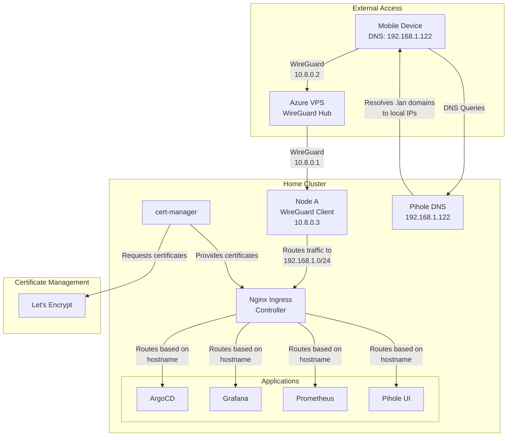

# Configuring Domain-Based Access with Ingress

## Table of Contents

- [Overview](#configuring-domain-based-access-with-ingress)
- [System Architecture](#system-architecture)
- [Quick Start / TLDR](#quick-start--tldr)
- [Prerequisites](#prerequisites)
- [Implementation Steps](#implementation-steps)
  - [1. Verify Ingress Controller](#1-verify-ingress-controller-is-running)
  - [2. Create ClusterIssuer](#2-create-clusterissuer-for-tls-certificates)
  - [3. Create Ingress Resources](#3-create-ingress-resources-for-services)
  - [4. Configure DNS Resolution](#4-configure-dns-resolution)
  - [5. Verify Certificates](#5-verify-certificate-issuance)
  - [6. Test Access](#6-test-access)
- [Troubleshooting](#troubleshooting)
- [Next Steps](#next-steps)

This guide describes how to configure your cluster services to be accessible via domain names rather than directly by IP addresses. We'll set up access to services through domains like:

- argocd.lan
- grafana.lan
- prometheus.lan
- pihole.lan

This configuration will work both from your local network and over WireGuard using Pihole for DNS resolution.

## Quick Start / TLDR

Sequence of actions to implement domain-based access:

1. **Verify prerequisites** - Ensure all components are running (WireGuard, Nginx Ingress, cert-manager, Pihole)
2. **Create ClusterIssuer** - Set up cert-manager's ClusterIssuer for TLS certificates
3. **Create Ingress resources** - Create ingress definitions for each service
4. **Configure DNS Resolution** - Ensure Pihole DNS is configured in WireGuard clients
5. **Verify certificate issuance** - Ensure TLS certificates are correctly issued
6. **Test access** - Access services via domain names from both local network and WireGuard

## System Architecture


```mermaid
graph TD
    subgraph "External Access"
        Mobile["Mobile Device<br>DNS: 192.168.1.122"]
        VPS["Azure VPS<br>WireGuard Hub"]
    end

    subgraph "Home Cluster"
        NodeA["Node A<br>WireGuard Client<br>10.8.0.3"]
        Ingress["Nginx Ingress<br>Controller"]
        CertMgr["cert-manager"]
        Pihole["Pihole DNS<br>192.168.1.122"]

        subgraph "Applications"
            ArgoCD["ArgoCD"]
            Grafana["Grafana"]
            Prometheus["Prometheus"]
            PiholeUI["Pihole UI"]
        end
    end

    subgraph "Certificate Management"
        LetsEncrypt["Let's Encrypt"]
    end

    %% WireGuard connections
    Mobile -- "WireGuard<br>10.8.0.2" --> VPS
    VPS -- "WireGuard<br>10.8.0.1" --> NodeA
    NodeA -- "Routes traffic to<br>192.168.1.0/24" --> Ingress

    %% DNS Resolution
    Mobile -- "DNS Queries" --> Pihole
    Pihole -- "Resolves .lan domains<br>to local IPs" --> Mobile

    %% Internal routing
    Ingress -- "Routes based on<br>hostname" --> ArgoCD
    Ingress -- "Routes based on<br>hostname" --> Grafana
    Ingress -- "Routes based on<br>hostname" --> Prometheus
    Ingress -- "Routes based on<br>hostname" --> PiholeUI

    %% Certificate management
    CertMgr -- "Requests certificates" --> LetsEncrypt
    CertMgr -- "Provides certificates" --> Ingress
```

## Prerequisites

Ensure you have the following components already set up:

- A working Kubernetes cluster with Kubespray
- WireGuard for remote access (configured as per the wireguard.yml playbook)
  - WireGuard clients configured to use Pihole (192.168.1.122) as DNS server
- cert-manager installed and working
- Pihole running and configured with custom DNS entries
- MetalLB for load balancing
- ArgoCD for deployments

## Implementation Steps

### 1. Verify Ingress Controller is Running

```bash
# Check if Nginx Ingress pods are running
kubectl get pods -n ingress-nginx
```

### 2. Create ClusterIssuer for TLS Certificates

Create a ClusterIssuer to handle TLS certificate requests:

```bash
# Create ClusterIssuer for certificate management
kubectl apply -f cluster-issuer.yaml
```

### 3. Create Ingress Resources for Services

Create ingress resources for each service you want to expose. Example for Pihole:

```bash
# Create ingress with TLS and correct namespace
kubectl apply -f pihole-ingress.yaml
```

### 4. Configure DNS Resolution

1. **Verify Pihole DNS Configuration**:
   - Check custom DNS entries in Pihole configmap
   - Verify all services have correct .lan entries

2. **Configure WireGuard Clients**:
   - Set DNS server to Pihole (192.168.1.122)
   - Example WireGuard client config:

     ```ini
     [Interface]
     PrivateKey = ...
     Address = 10.8.0.2/24
     DNS = 192.168.1.122

     [Peer]
     PublicKey = ...
     Endpoint = ...
     AllowedIPs = 10.8.0.0/24, 192.168.1.0/24
     ```

### 5. Verify Certificate Issuance

```bash
# Check certificate status
kubectl get certificates -A
```

### 6. Test Access

1. **Local Network Access**:

   ```bash
   curl -k https://pihole.lan
   ```

2. **WireGuard Access**:

   ```bash
   # First verify DNS resolution
   nslookup pihole.lan

   # Then test HTTPS access
   curl -k https://pihole.lan
   ```

## Troubleshooting

### DNS Resolution Issues

- Verify WireGuard client DNS configuration
- Check Pihole custom DNS entries
- Verify WireGuard routing for 192.168.1.0/24

### Certificate Issues

- Check certificate status and events
- Verify ClusterIssuer configuration
- Check cert-manager logs

### Access Issues

- Verify WireGuard connection
- Check ingress controller logs
- Verify service endpoints

## Next Steps

- Add authentication for sensitive services
- Configure additional services
- Set up monitoring for certificates
- Create backup strategy for configurations
