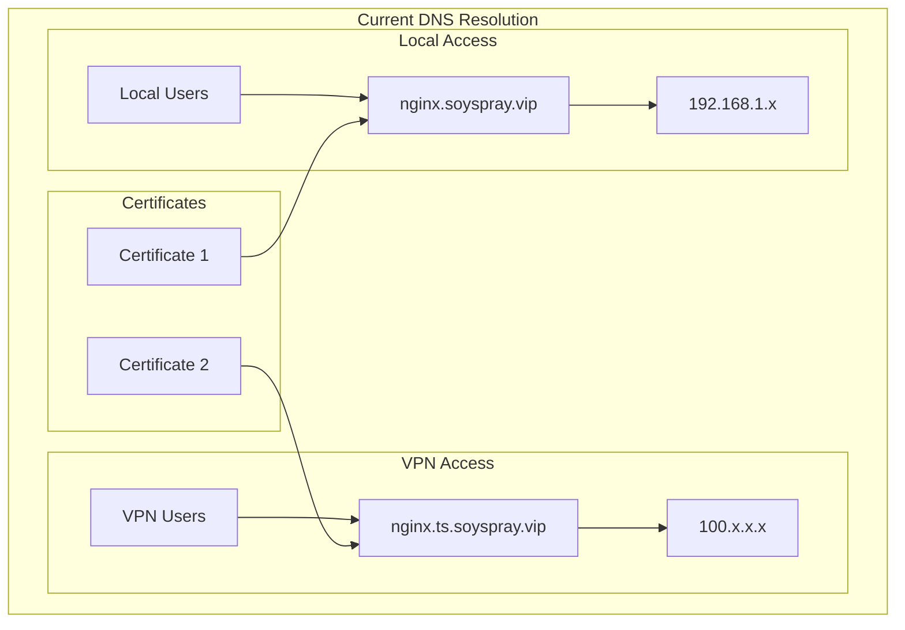
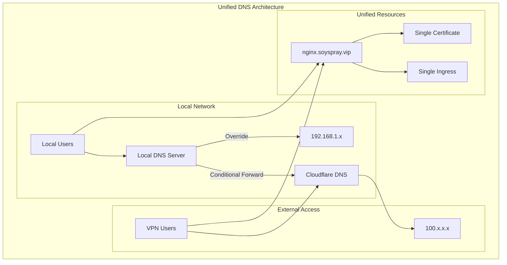
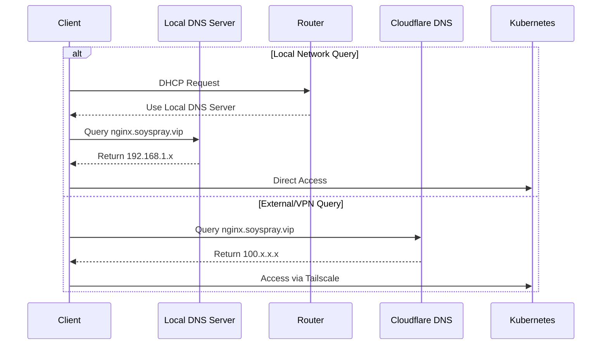
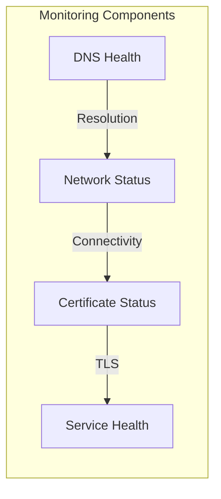

# Local DNS Override Plan

## Overview

This document outlines the plan to implement local DNS override (split-horizon DNS) for unified domain access to cluster services. The goal is to use a single hostname that resolves to different IPs based on the client's location (local vs. VPN/external).

## Current Architecture



## Target Architecture



## DNS Resolution Flow



## Implementation Components

1. DNS Server Requirements
   - Hardware: Dedicated Pi or VM
   - Software: dnsmasq/Pi-hole
   - Network: Static IP
   - DHCP Integration

2. Network Configuration
   - DHCP Server Settings
   - DNS Forwarding Rules
   - Firewall Configurations
   - NAT Considerations

3. Certificate Management
   - Single Wildcard Certificate
   - Let's Encrypt Integration
   - Automated Renewal
   - Backup Procedures

## Implementation Steps

1. DNS Server Setup
   - Deploy local DNS server
   - Configure DNS override rules
   - Test local resolution
   - Set up monitoring

2. Network Configuration
   - Update DHCP settings
   - Configure DNS forwarding
   - Test network paths
   - Verify connectivity

3. Cloudflare Updates
   - Update DNS records
   - Remove .ts subdomain
   - Verify external resolution
   - Monitor propagation

4. Certificate Consolidation
   - Update cert-manager
   - Deploy unified certificate
   - Validate TLS access
   - Monitor expiration

5. ArgoCD Integration
   - Update applications
   - Modify ingress resources
   - Deploy changes
   - Verify routing

## Configuration Examples

### dnsmasq Configuration

```ini
# Local DNS override for cluster services
address=/nginx.soyspray.vip/192.168.1.x
address=/grafana.soyspray.vip/192.168.1.x
address=/prometheus.soyspray.vip/192.168.1.x

# Forward all other queries to Cloudflare
server=1.1.1.1
server=1.0.0.1
```

### DHCP Configuration

```ini
# DHCP server configuration
dhcp-option=option:dns-server,192.168.1.53
dhcp-option=option:domain-name,soyspray.vip
```

## Testing Strategy

1. DNS Resolution Tests
   - Local hostname resolution
   - External hostname resolution
   - DNS propagation checks
   - DHCP lease testing

2. Network Path Validation
   - Local network access
   - VPN network access
   - Latency measurements
   - MTU verification

3. Certificate Verification
   - TLS handshake tests
   - Certificate validation
   - Renewal process
   - Expiration monitoring

4. Service Access Tests
   - Local service access
   - VPN service access
   - Performance metrics
   - Error handling

## Monitoring Plan



## Rollback Procedures

1. DNS Restoration
   - Backup current config
   - Revert DNS changes
   - Restore original records
   - Verify resolution

2. Certificate Rollback
   - Backup certificates
   - Restore previous certs
   - Update ingress
   - Validate access

3. Network Rollback
   - Document changes
   - Revert DHCP config
   - Update firewall rules
   - Test connectivity

## Success Criteria

1. DNS Resolution
   - Correct local resolution
   - Proper external resolution
   - Fast query response
   - No resolution errors

2. Certificate Management
   - Single valid certificate
   - Automated renewal
   - No validation errors
   - Proper chain trust

3. Network Performance
   - Low latency access
   - Stable connections
   - No routing loops
   - Clean failover

4. Service Availability
   - 100% availability
   - Proper load balancing
   - Error-free access
   - Consistent performance

## Operational Notes

1. Maintenance Procedures
   - Regular backups
   - Update schedule
   - Monitoring checks
   - Documentation updates

2. Troubleshooting Guide
   - Common issues
   - Resolution steps
   - Contact information
   - Escalation path

3. Security Considerations
   - Access controls
   - Update policies
   - Audit procedures
   - Incident response
