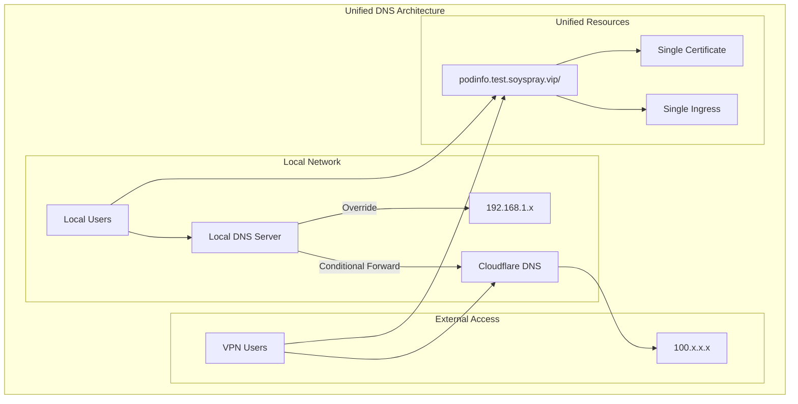
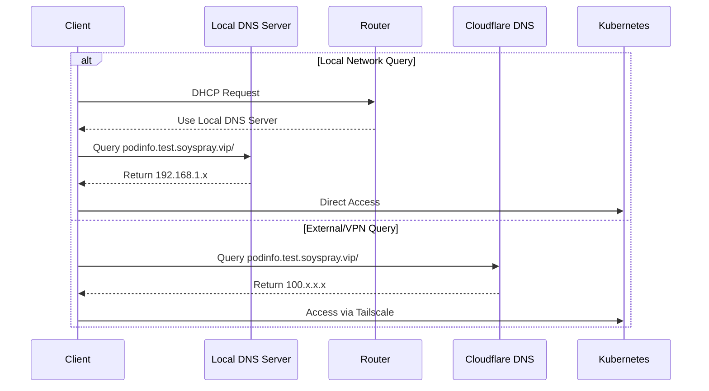

# Local DNS Override Plan

## Overview

This document outlines the plan to implement local DNS override (split-horizon DNS) for unified domain access to cluster services. The goal is to use a single hostname that resolves to different IPs based on the client's location (local vs. VPN/external).

## Target Architecture

## DNS Resolution Flow

