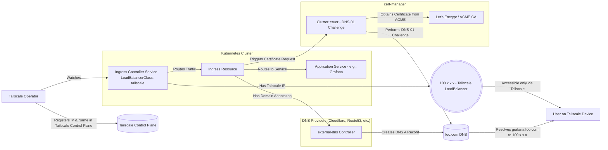
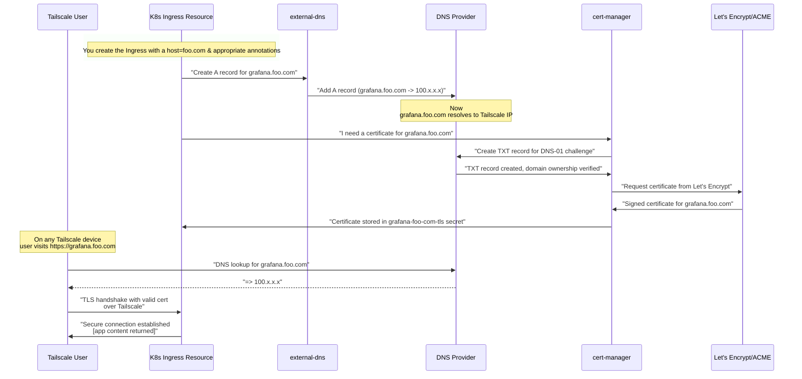

# trying again

High-Level Architecture

```mermaid
flowchart LR
    A[Tailscale Operator] -->|Watches| B[Ingress Controller Service - LoadBalancerClass: tailscale]
    B -->|Has Tailscale IP| C(((100.x.x.x - Tailscale LoadBalancer)))
    C -->|Accessible only via Tailscale| F[User on Tailscale Device]

    subgraph "Kubernetes Cluster"
      B
      D[Application Service - e.g., Grafana]
      E[Ingress Resource]

      B -->|Routes Traffic| E
      E -->|Routes to Service| D
    end

    A -->|Registers IP & Name in Tailscale Control Plane| G[(Tailscale Control Plane)]

    subgraph "DNS Providers (Cloudflare, Route53, etc.)"
      H[external-dns Controller]
    end

    E -->|Has Domain Annotation| H
    H -->|Creates DNS A Record| I[(foo.com DNS)]
    I -->|Resolves grafana.foo.com to 100.x.x.x| F

    subgraph "cert-manager"
      J[ClusterIssuer - DNS-01 Challenge]
      K[Let's Encrypt / ACME CA]
    end

    E -->|Triggers Certificate Request| J
    J -->|Performs DNS-01 Challenge| I
    J -->|Obtains Certificate from ACME| K
```

Certificate & DNS Flow

```mermaid
sequenceDiagram
    participant User as Tailscale User
    participant Ingress as K8s Ingress Resource
    participant externalDNS as external-dns
    participant DNSProvider as DNS Provider
    participant certManager as cert-manager
    participant ACME as Let's Encrypt/ACME

    rect rgba(200, 255, 200, 0.1)
    Note over Ingress: You create the Ingress with a host=foo.com & appropriate annotations
    end

    Ingress->>externalDNS: "Create A record for grafana.foo.com"
    externalDNS->>DNSProvider: "Add A record (grafana.foo.com -> 100.x.x.x)"

    Note over DNSProvider: Now <br> grafana.foo.com resolves to Tailscale IP

    Ingress->>certManager: "I need a certificate for grafana.foo.com"
    certManager->>DNSProvider: "Create TXT record for DNS-01 challenge"
    DNSProvider->>certManager: "TXT record created, domain ownership verified"

    certManager->>ACME: "Request certificate from Let's Encrypt"
    ACME->>certManager: "Signed certificate for grafana.foo.com"
    certManager->>Ingress: "Certificate stored in grafana-foo-com-tls secret"

    Note over User: On any Tailscale device <br> user visits https://grafana.foo.com
    User->>DNSProvider: "DNS lookup for grafana.foo.com"
    DNSProvider-->>User: "=> 100.x.x.x"
    User->>Ingress: "TLS handshake with valid cert <br> over Tailscale"
    Ingress->>User: "Secure connection established <br> [app content returned]"
```
