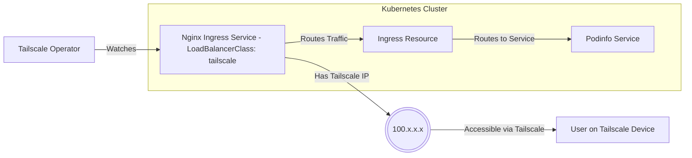
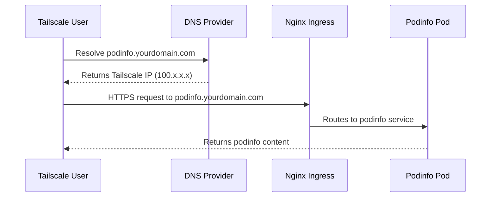

# Exposing Services with Tailscale in Home K8s Cluster

## High-Level Architecture



## Certificate & DNS Flow



## Implementation Steps

1. Update nginx-ingress service to use Tailscale:
```yaml
# values.yaml for nginx-ingress or direct service edit
controller:
  service:
    type: LoadBalancer
    loadBalancerClass: tailscale
```

2. Create ingress for podinfo:
```yaml
apiVersion: networking.k8s.io/v1
kind: Ingress
metadata:
  name: podinfo
  namespace: default  # or your namespace
  annotations:
    cert-manager.io/cluster-issuer: letsencrypt-prod
    external-dns.alpha.kubernetes.io/hostname: podinfo.yourdomain.com
spec:
  ingressClassName: nginx
  rules:
  - host: podinfo.yourdomain.com
    http:
      paths:
      - path: /
        pathType: Prefix
        backend:
          service:
            name: podinfo
            port:
              number: 9898
  tls:
  - hosts:
    - podinfo.yourdomain.com
    secretName: podinfo-tls
```

## Notes
- This setup leverages existing cluster components:
  - nginx-ingress (with metallb)
  - cert-manager
  - external-dns
  - tailscale operator
  - argocd for deployments
- Local resources will still be accessed via pihole DNS directly
- Only services that need external access will be exposed through Tailscale
