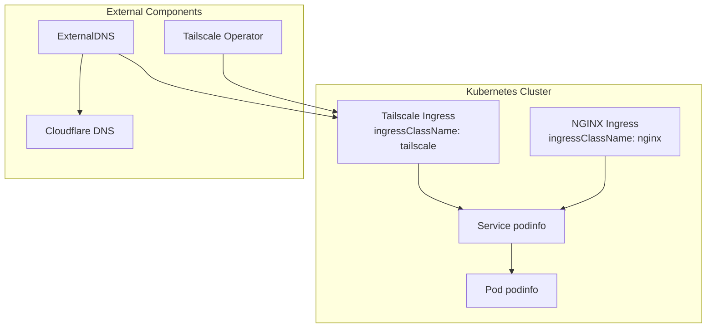
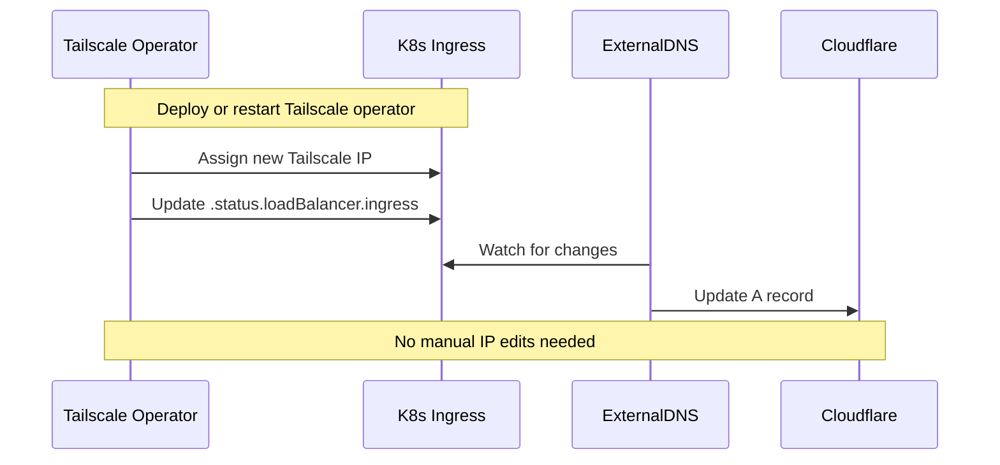

# Automating Tailscale IP in Kubernetes

## Overview

### Goal

1. Stop hardcoding Tailscale IP addresses
2. Dynamically expose Kubernetes workloads over Tailscale
3. Automate external DNS updates in Cloudflare when Tailscale IP changes

### Why This Matters

1. Tailscale IPs (100.x.x.x) can change upon restarts or upgrades of the operator
2. Hardcoded IPs lead to stale DNS and broken traffic
3. Letting Tailscale act as LoadBalancer allows Kubernetes to write IP to .status.loadBalancer.ingress

## Current Setup Issues

ExternalDNS has IP-based annotation filter:

```yaml
extraArgs:
  - --annotation-filter=external-dns.alpha.kubernetes.io/target in (100.69.17.31)
```

Ingress explicitly sets:

```yaml
annotations:
  external-dns.alpha.kubernetes.io/target: "100.69.17.31"
```

When Tailscale operator restarts, it assigns different IP (e.g. 100.100.115.18), leaving Cloudflare pointing to old address.

## Implementation Plan

### 1. Switch to Tailscale Ingress Class

Remove IP references from ExternalDNS and Ingress. Use ingressClassName: tailscale to let Tailscale operator become LoadBalancer.

Example ingress.yaml:

```yaml
apiVersion: networking.k8s.io/v1
kind: Ingress
metadata:
  name: podinfo
  namespace: podinfo
  annotations:
    cert-manager.io/cluster-issuer: letsencrypt-staging
    cert-manager.io/common-name: podinfo.test.soyspray.vip
    nginx.ingress.kubernetes.io/force-ssl-redirect: "true"
    external-dns.alpha.kubernetes.io/hostname: "podinfo.test.soyspray.vip"
    external-dns.alpha.kubernetes.io/ttl: "60"
spec:
  ingressClassName: tailscale
  rules:
    - host: podinfo.test.soyspray.vip
      http:
        paths:
          - path: /
            pathType: Prefix
            backend:
              service:
                name: podinfo
                port:
                  number: 9898
  tls:
    - hosts:
        - podinfo.test.soyspray.vip
      secretName: podinfo-cert-tls
```

### 2. Clean Up ExternalDNS Values

Remove IP-based annotation filter:

```yaml
provider:
  name: cloudflare

env:
  - name: CF_API_TOKEN
    valueFrom:
      secretKeyRef:
        name: cloudflare-api-token
        key: api-token

domainFilters:
  - soyspray.vip

policy: upsert-only
registry: txt
txtOwnerId: k8s

sources:
  - ingress

extraArgs:
  - --txt-prefix=external-dns-
  - --ignore-ingress-tls-spec
  - --ignore-ingress-rules-spec
```

### 3. Dual Ingress Setup

Keep nginx Ingress for local/traditional LB and add Tailscale Ingress for remote access:

1. nginx Ingress (ingressClassName: nginx) for internal usage
2. Tailscale Ingress (ingressClassName: tailscale) for Tailscale access

Kubernetes spins up separate resources for each IngressClass without conflicts.

Optional: Filter which Ingress gets published:

```yaml
extraArgs:
  - --annotation-filter=external-dns.alpha.kubernetes.io/publish=tail

annotations:
  external-dns.alpha.kubernetes.io/publish: "tail"
```

## Verification

### Check Tailscale Operator & Ingress

```sh
kubectl get ingress podinfo -n podinfo -o yaml
```

Look for IP like 100.100.115.18 in .status.loadBalancer.ingress

### Check DNS

```sh
dig podinfo.test.soyspray.vip +short
```

Should show assigned Tailscale IP

### Test Access

```sh
curl -vk https://podinfo.test.soyspray.vip
```

Note: Requires Tailscale client or Funnel enabled

## Advanced Cases

### Tailscale Funnel for Public Access

```yaml
annotations:
  tailscale.com/funnel: "true"
```

Update ACLs to allow funnel usage for operator-tagged devices.

### LoadBalancer Service Alternative

```yaml
apiVersion: v1
kind: Service
metadata:
  name: my-lb-service
spec:
  type: LoadBalancer
  loadBalancerClass: tailscale
  ports:
    - name: http
      port: 80
      targetPort: 8080
  selector:
    app: my-app
```

## Flow Diagrams

### Dual Ingress Architecture



### Automated Lifecycle



## References

1. [Tailscale Operator Docs](https://tailscale.com/kb/1185/kubernetes/)
2. [Expose workload to tailnet](https://tailscale.com/kb/1439/kubernetes-operator-cluster-ingress/)
3. [ExternalDNS](https://github.com/kubernetes-sigs/external-dns)
4. [Nginx Ingress](https://kubernetes.github.io/ingress-nginx/)
5. [Kubernetes Ingress](https://kubernetes.io/docs/concepts/services-networking/ingress/)
