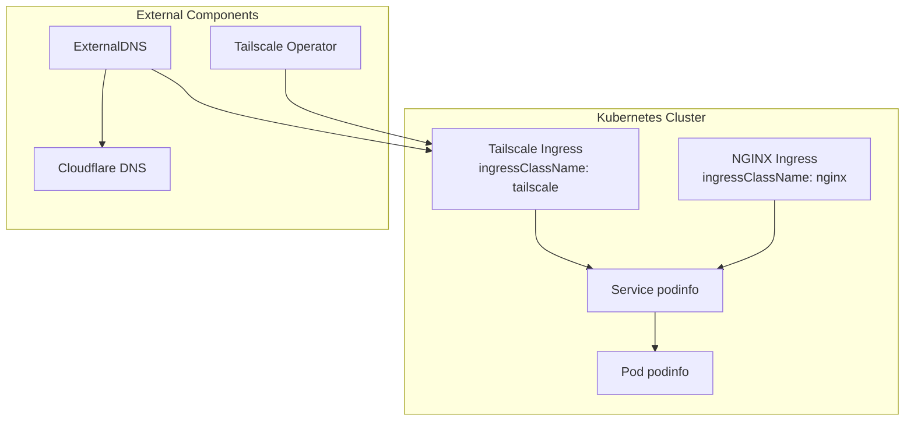
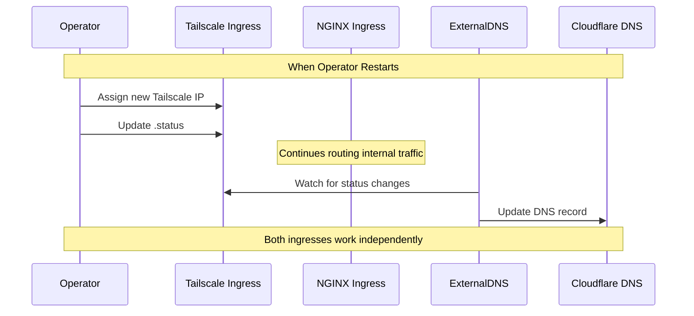

# Automating Tailscale IP in Kubernetes

## Current Setup

We have hardcoded Tailscale IP in two places:

```yaml
extraArgs:
  - --annotation-filter=external-dns.alpha.kubernetes.io/target in (100.69.17.31)
```

```yaml
annotations:
  external-dns.alpha.kubernetes.io/target: "100.69.17.31"
```

## Problem

The Tailscale IP changes when operator restarts. Screenshot shows different IPs after operator restart:

```
ingress-nginx-ingress-nginx: 100.100.115.18
ingress-nginx-ingress-nginx-1: 100.69.17.31
```

## Solution

Use dual ingress setup:

1. Keep nginx ingress for internal routing
2. Add Tailscale ingress for dynamic IP management
3. Let ExternalDNS read IPs from Tailscale ingress status

## Implementation Steps

1. Remove hardcoded IP from external-dns values.yaml:

```yaml
sources:
  - ingress

extraArgs:
  - --txt-prefix=external-dns-
  - --ignore-ingress-tls-spec
  - --ignore-ingress-rules-spec
  - --fqdn-template={{.Name}}.{{.Namespace}}.soyspray.vip

domainFilters:
  - soyspray.vip
policy: upsert-only
registry: txt
txtOwnerId: k8s
provider:
  name: cloudflare
```

2. Keep existing nginx ingress but remove IP annotations:

```yaml
apiVersion: networking.k8s.io/v1
kind: Ingress
metadata:
  name: podinfo
  namespace: podinfo
  annotations:
    cert-manager.io/cluster-issuer: letsencrypt-staging
    cert-manager.io/common-name: podinfo.test.soyspray.vip
    nginx.ingress.kubernetes.io/force-ssl-redirect: "true"
    external-dns.alpha.kubernetes.io/hostname: "podinfo.test.soyspray.vip"
    external-dns.alpha.kubernetes.io/ttl: "60"
spec:
  ingressClassName: nginx
  rules:
    - host: podinfo.test.soyspray.vip
      http:
        paths:
          - path: /
            pathType: Prefix
            backend:
              service:
                name: podinfo
                port:
                  number: 9898
  tls:
    - hosts:
        - podinfo.test.soyspray.vip
      secretName: podinfo-cert-tls
```

3. Add new Tailscale ingress:

```yaml
apiVersion: networking.k8s.io/v1
kind: Ingress
metadata:
  name: podinfo-tailscale
  namespace: podinfo
  annotations:
    external-dns.alpha.kubernetes.io/hostname: "podinfo.test.soyspray.vip"
    external-dns.alpha.kubernetes.io/ttl: "60"
spec:
  ingressClassName: tailscale
  rules:
    - host: podinfo.test.soyspray.vip
      http:
        paths:
          - path: /
            pathType: Prefix
            backend:
              service:
                name: podinfo
                port:
                  number: 9898
  tls:
    - hosts:
        - podinfo.test.soyspray.vip
```

## How It Works

1. Nginx ingress handles internal traffic routing
2. Tailscale ingress provides dynamic IP management
3. Tailscale operator updates ingress status with new IP
4. ExternalDNS reads IP from Tailscale ingress status
5. DNS records update automatically when IP changes

## Verification

Check both ingress statuses:

```sh
kubectl get ingress -n podinfo
kubectl get ingress podinfo -n podinfo -o yaml
kubectl get ingress podinfo-tailscale -n podinfo -o yaml
```

Check DNS record updates:

```sh
dig podinfo.test.soyspray.vip
```

Test HTTPS access:

```sh
curl -v https://podinfo.test.soyspray.vip
```

## Additional Options

Use Tailscale Funnel to expose service publicly:

```yaml
metadata:
  annotations:
    tailscale.com/funnel: "true"
spec:
  ingressClassName: tailscale
```

Use LoadBalancer service instead of Ingress:

```yaml
spec:
  type: LoadBalancer
  loadBalancerClass: tailscale
```

## Flow Diagrams

Dual Ingress Architecture:



Automatic IP Update Flow:


