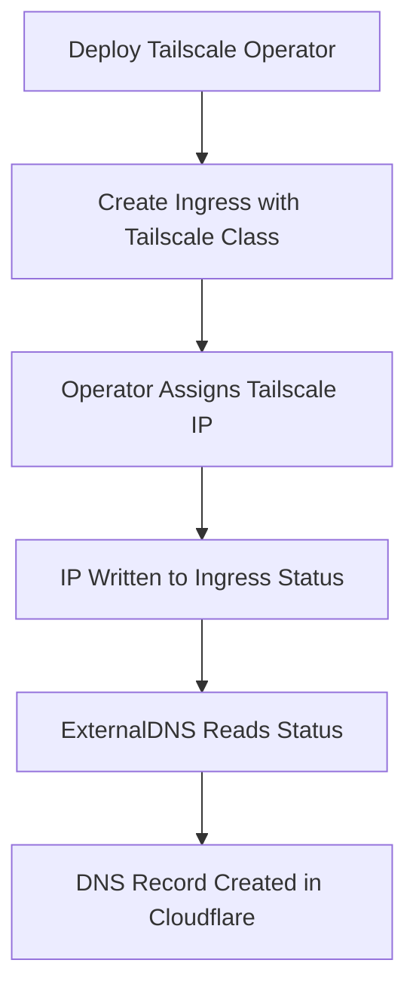
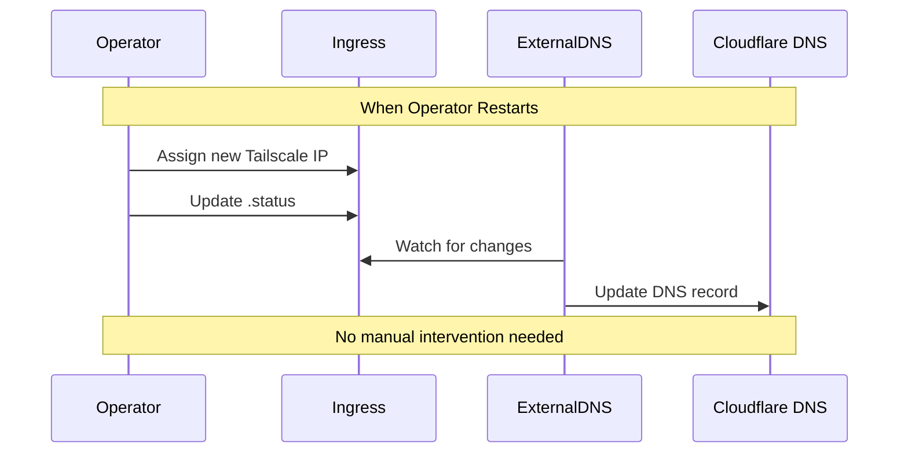

# Automating Tailscale IP in Kubernetes

## Current Setup

We have hardcoded Tailscale IP in two places:

```yaml
extraArgs:
  - --annotation-filter=external-dns.alpha.kubernetes.io/target in (100.69.17.31)
```

```yaml
annotations:
  external-dns.alpha.kubernetes.io/target: "100.69.17.31"
```

## Problem

The Tailscale IP changes when operator restarts. Screenshot shows different IPs after operator restart:

```
ingress-nginx-ingress-nginx: 100.100.115.18
ingress-nginx-ingress-nginx-1: 100.69.17.31
```

## Solution

Use Tailscale operator as LoadBalancer controller and let ExternalDNS read IPs dynamically.

## Implementation Steps

1. Remove hardcoded IP from external-dns values.yaml:

```yaml
sources:
  - ingress

extraArgs:
  - --txt-prefix=external-dns-
  - --ignore-ingress-tls-spec
  - --ignore-ingress-rules-spec
  - --fqdn-template={{.Name}}.{{.Namespace}}.soyspray.vip

domainFilters:
  - soyspray.vip
policy: upsert-only
registry: txt
txtOwnerId: k8s
provider:
  name: cloudflare
```

2. Update ingress.yaml to use Tailscale ingress:

```yaml
apiVersion: networking.k8s.io/v1
kind: Ingress
metadata:
  name: podinfo
  namespace: podinfo
  annotations:
    cert-manager.io/cluster-issuer: letsencrypt-staging
    cert-manager.io/common-name: podinfo.test.soyspray.vip
    nginx.ingress.kubernetes.io/force-ssl-redirect: "true"
    external-dns.alpha.kubernetes.io/hostname: "podinfo.test.soyspray.vip"
    external-dns.alpha.kubernetes.io/ttl: "60"
spec:
  ingressClassName: tailscale
  rules:
    - host: podinfo.test.soyspray.vip
      http:
        paths:
          - path: /
            pathType: Prefix
            backend:
              service:
                name: podinfo
                port:
                  number: 9898
  tls:
    - hosts:
        - podinfo.test.soyspray.vip
      secretName: podinfo-cert-tls
```

## How It Works

1. Tailscale operator assigns IP to ingress
2. IP gets written to .status.loadBalancer.ingress
3. ExternalDNS reads IP from status and updates DNS
4. When operator restarts and IP changes, process repeats automatically

## Verification

Check ingress status for new IP:

```sh
kubectl get ingress podinfo -n podinfo -o yaml
```

Check DNS record updates:

```sh
dig podinfo.test.soyspray.vip
```

Test HTTPS access:

```sh
curl -v https://podinfo.test.soyspray.vip
```

## Additional Options

Use Tailscale Funnel to expose service publicly:

```yaml
metadata:
  annotations:
    tailscale.com/funnel: "true"
spec:
  ingressClassName: tailscale
```

Use LoadBalancer service instead of Ingress:

```yaml
spec:
  type: LoadBalancer
  loadBalancerClass: tailscale
```

## Flow Diagrams

Initial Setup Flow:



Automatic IP Update Flow:


