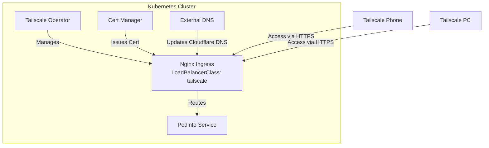
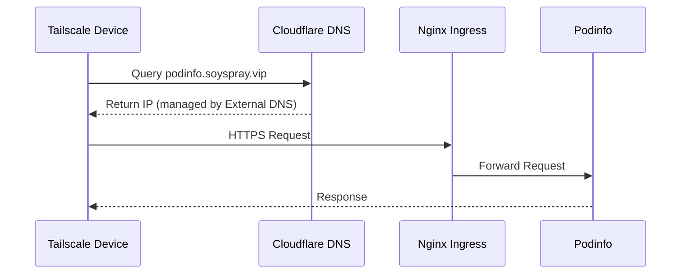

# Exposing Podinfo via Tailscale - Implementation Plan

## Overview

This document outlines the step-by-step plan to expose the podinfo application via Tailscale in our home Kubernetes cluster, using Cloudflare DNS (soyspray.vip) and our existing cert-manager setup. All components are managed via ArgoCD, following GitOps principles.

## Architecture



## Certificate and DNS Flow



## Implementation Steps

### 1. Prerequisites Verification

Verify all required components are running:

```bash
# Check Tailscale Operator
kubectl get pods -n tailscale
kubectl get tailscale -n tailscale

# Check Nginx Ingress
kubectl get pods -n ingress-nginx
kubectl get svc -n ingress-nginx

# Check Cert Manager
kubectl get pods -n cert-manager
kubectl get clusterissuers

# Check External DNS
kubectl get pods -n external-dns
```

### 2. Update Nginx Ingress ArgoCD App

Update the nginx-ingress ArgoCD application to use Tailscale LoadBalancer:

```yaml
# nginx-ingress/values.yaml
controller:
  service:
    type: LoadBalancer
    loadBalancerClass: tailscale
```

Verification:
```bash
# Check service has Tailscale IP
kubectl get svc -n ingress-nginx nginx-ingress-controller -o wide

# Verify from Tailscale admin panel that IP is registered
tailscale status
```

### 3. Configure Podinfo Ingress

Create/update podinfo ingress in ArgoCD app:

```yaml
apiVersion: networking.k8s.io/v1
kind: Ingress
metadata:
  name: podinfo
  annotations:
    cert-manager.io/cluster-issuer: letsencrypt-prod
    external-dns.alpha.kubernetes.io/hostname: podinfo.soyspray.vip
spec:
  ingressClassName: nginx
  tls:
  - hosts:
    - podinfo.soyspray.vip
    secretName: podinfo-tls
  rules:
  - host: podinfo.soyspray.vip
    http:
      paths:
      - path: /
        pathType: Prefix
        backend:
          service:
            name: podinfo
            port:
              number: 9898
```

Verification:
```bash
# Check ingress is created
kubectl get ingress podinfo

# Check TLS certificate
kubectl get certificate podinfo-tls
kubectl describe certificate podinfo-tls

# Check DNS record in Cloudflare
dig podinfo.soyspray.vip
```

### 4. End-to-End Testing

From Tailscale-connected devices:

```bash
# From PC
curl -v https://podinfo.soyspray.vip

# From Android Phone
# Open browser and navigate to https://podinfo.soyspray.vip
```

Expected results:
- HTTPS connection successful with valid certificate from Let's Encrypt
- Podinfo UI/API accessible
- Connection works from all Tailscale devices
- DNS resolution working through Cloudflare

### 5. Monitoring

Monitor the setup:

```bash
# Check Tailscale operator logs
kubectl logs -n tailscale -l app=tailscale-operator

# Check Nginx Ingress logs
kubectl logs -n ingress-nginx -l app.kubernetes.io/name=ingress-nginx

# Check Podinfo logs
kubectl logs -l app=podinfo

# Check External DNS logs for Cloudflare updates
kubectl logs -n external-dns -l app=external-dns
```

## Rollback Plan

If issues occur:

1. Revert Nginx Ingress to previous configuration:
```bash
kubectl patch svc nginx-ingress-controller -n ingress-nginx --type=json \
  -p='[{"op": "remove", "path": "/spec/loadBalancerClass"}]'
```

2. Remove Podinfo Ingress:
```bash
kubectl delete ingress podinfo
```

3. Remove DNS record from Cloudflare if needed (this should be handled by external-dns)

## Success Criteria

- Podinfo accessible via HTTPS on podinfo.soyspray.vip
- Valid Let's Encrypt TLS certificate issued by cert-manager
- DNS resolution working through Cloudflare
- Access working from all Tailscale devices
- No exposure outside Tailscale network
- External-dns successfully managing Cloudflare DNS records
