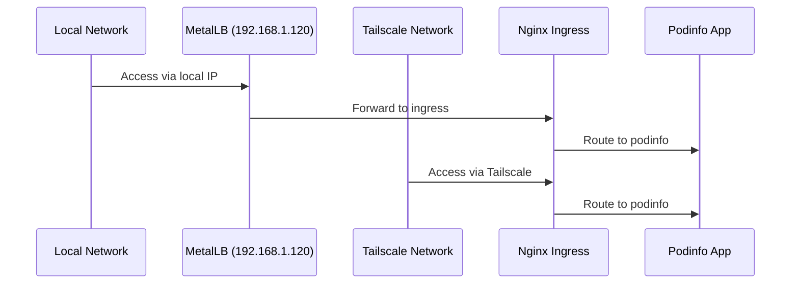
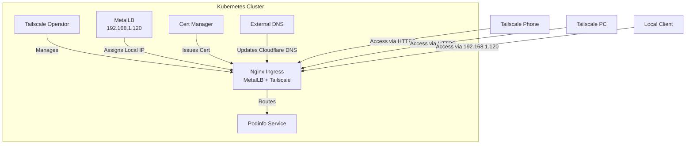
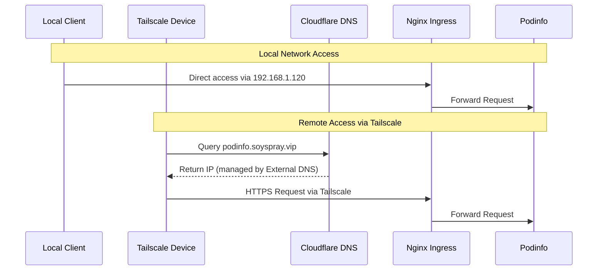

# Exposing Podinfo via Tailscale - Implementation Plan

## Overview

This document outlines the step-by-step plan to expose the podinfo application via Tailscale in our home Kubernetes cluster, using Cloudflare DNS (soyspray.vip) and our existing cert-manager setup. The cluster is provisioned with Kubespray and uses MetalLB for load balancing. All components are managed via ArgoCD, following GitOps principles.

## Current Setup Analysis

### Component Configuration Files

1. **Ingress Controller (ingress-nginx)**
   - Service Type: LoadBalancer (MetalLB)
   - Current IP: 192.168.1.120 (assigned by MetalLB)
   - Status: Running with MetalLB integration
   - Configuration: Service has both MetalLB annotation and Tailscale finalizer

   ```yaml
   metadata:
     annotations:
       metallb.universe.tf/ip-allocated-from-pool: primary
     finalizers:
     - tailscale.com/finalizer
   ```

2. **Certificate Management**
   - Location: `playbooks/yaml/argocd-apps/cert-manager/`
   - Key Files:
     - `prod-certificate.yaml`: Wildcard certificate for *.soyspray.vip
     - `letsencrypt-issuers.yaml`: Production and staging ClusterIssuers
   - Status: Configured for DNS01 challenges via Cloudflare

3. **DNS Management**
   - Location: `playbooks/yaml/argocd-apps/external-dns/`
   - Key Files:
     - `values.yaml`: Cloudflare configuration and domain filters
     - `external-dns-application.yaml`: ArgoCD application definition

4. **Podinfo Application**
   - Location: `playbooks/yaml/argocd-apps/podinfo/`
   - Key Files:
     - `podinfo-application.yaml`: Main application definition
     - `values.yaml`: Helm chart configuration

5. **Tailscale Operator**
   - Location: `playbooks/yaml/argocd-apps/tailscale/`
   - Key Files:
     - `tailscale-operator-application.yaml`: Operator deployment
     - `values.yaml`: Tailscale configuration and tags

## Implementation Plan

### 1. Update Ingress Controller Configuration

The ingress-nginx service already has both MetalLB and Tailscale integration. No immediate changes required as it's working with:

- MetalLB IP (192.168.1.120) for local access
- Tailscale finalizer for remote access

### 2. Configure Podinfo Service

Update Podinfo's service configuration in `playbooks/yaml/argocd-apps/podinfo/values.yaml`:

```yaml
service:
  type: LoadBalancer
  loadBalancerClass: tailscale
  annotations:
    metallb.universe.tf/ip-allocated-from-pool: primary
```

### 3. Certificate Management

Current configuration in `playbooks/yaml/argocd-apps/cert-manager/prod-certificate.yaml` already covers our needs:

```yaml
spec:
  dnsNames:
    - "*.soyspray.vip"
    - "soyspray.vip"
```

### 4. DNS Configuration

The external-dns configuration in `playbooks/yaml/argocd-apps/external-dns/values.yaml` is already set up for Cloudflare:

```yaml
provider:
  name: cloudflare
domainFilters:
  - soyspray.vip
```

### 5. Network Flow



## Verification Steps

1. **Local Access Check**

```bash
curl -v https://podinfo.soyspray.vip --resolve podinfo.soyspray.vip:443:192.168.1.120
```

2. **Tailscale Access Check**

```bash
# From any Tailscale device
curl -v https://podinfo.soyspray.vip
```

3. **Certificate Verification**

```bash
# Check certificate status
kubectl get certificate -n cert-manager
```

4. **DNS Record Verification**

```bash
# Check DNS records
dig podinfo.soyspray.vip
```

## Success Criteria

1. Local network access works via MetalLB IP (192.168.1.120)
2. Remote access works via Tailscale network
3. HTTPS works with valid certificates
4. DNS records are properly managed by external-dns
5. Both ingress-nginx and podinfo services are accessible via both networks

## Troubleshooting

1. **MetalLB IP Issues**
   - Check MetalLB pool configuration
   - Verify service annotations

   ```bash
   kubectl get svc -n ingress-nginx -o yaml | grep metallb
   ```

2. **Tailscale Connectivity**
   - Check Tailscale operator logs

   ```bash
   kubectl logs -n tailscale-system -l app=tailscale-operator
   ```

3. **Certificate Issues**
   - Verify cert-manager challenges

   ```bash
   kubectl get challenges -n cert-manager
   ```

4. **DNS Issues**
   - Check external-dns logs

   ```bash
   kubectl logs -n external-dns -l app=external-dns
   ```

## Architecture



## Network Flow



## Implementation Steps

### 1. Prerequisites Verification

Verify all required components are running:

```bash
# Check Tailscale Operator
kubectl get pods -n tailscale-system
kubectl get tailscale -n tailscale-system

# Check Nginx Ingress and its MetalLB IP
kubectl get svc -n ingress-nginx
kubectl get svc ingress-nginx -n ingress-nginx -o jsonpath='{.status.loadBalancer.ingress[0].ip}'

# Check MetalLB
kubectl get pods -n metallb-system
kubectl get ipaddresspools -n metallb-system

# Check Cert Manager
kubectl get pods -n cert-manager
kubectl get clusterissuers

# Check External DNS
kubectl get pods -n external-dns
```

### 2. Update Nginx Ingress ArgoCD App

The ingress-nginx service will maintain its MetalLB configuration while adding Tailscale support:

```yaml
# nginx-ingress/values.yaml
controller:
  service:
    type: LoadBalancer
    loadBalancerClass: tailscale  # Add Tailscale support
    annotations:
      metallb.universe.tf/ip-allocated-from-pool: primary  # Maintain MetalLB config
```

```bash
ansible-playbook -i kubespray/inventory/soycluster/hosts.yml --become --become-user=root --user ubuntu kubespray/cluster.yml --tags ingress-nginx
```

Verification:

```bash
# Check service has both MetalLB and Tailscale configuration
kubectl get svc ingress-nginx -n ingress-nginx -o yaml
```

### 3. Configure Podinfo Ingress

Create/update podinfo ingress in ArgoCD app:

```yaml
apiVersion: networking.k8s.io/v1
kind: Ingress
metadata:
  name: podinfo
  annotations:
    cert-manager.io/cluster-issuer: letsencrypt-staging
    external-dns.alpha.kubernetes.io/hostname: podinfo.soyspray.vip
spec:
  ingressClassName: nginx
  tls:
  - hosts:
    - podinfo.soyspray.vip
    secretName: podinfo-tls
  rules:
  - host: podinfo.soyspray.vip
    http:
      paths:
      - path: /
        pathType: Prefix
        backend:
          service:
            name: podinfo
            port:
              number: 9898
```

Verification:

```bash
# Check ingress is created
kubectl get ingress podinfo

# Check TLS certificate
kubectl get certificate podinfo-tls
kubectl describe certificate podinfo-tls

# Check DNS record in Cloudflare
dig podinfo.soyspray.vip
```

### 4. End-to-End Testing

From Tailscale-connected devices:

```bash
# From PC
curl -v https://podinfo.soyspray.vip

# From Android Phone
# Open browser and navigate to https://podinfo.soyspray.vip
```

Expected results:

- HTTPS connection successful with valid certificate from Let's Encrypt
- Podinfo UI/API accessible
- Connection works from all Tailscale devices
- DNS resolution working through Cloudflare

### 5. Monitoring

Monitor the setup:

```bash
# Check Tailscale operator logs
kubectl logs -n tailscale -l app=tailscale-operator

# Check Nginx Ingress logs
kubectl logs -n ingress-nginx -l app.kubernetes.io/name=ingress-nginx

# Check Podinfo logs
kubectl logs -l app=podinfo

# Check External DNS logs for Cloudflare updates
kubectl logs -n external-dns -l app=external-dns
```

## Rollback Plan

If issues occur:

1. Revert Nginx Ingress to previous configuration:

```bash
kubectl patch svc nginx-ingress-controller -n ingress-nginx --type=json \
  -p='[{"op": "remove", "path": "/spec/loadBalancerClass"}]'
```

2. Remove Podinfo Ingress:

```bash
kubectl delete ingress podinfo
```

3. Remove DNS record from Cloudflare if needed (this should be handled by external-dns)

## Success Criteria

- Podinfo accessible via HTTPS on podinfo.soyspray.vip
- Valid Let's Encrypt TLS certificate issued by cert-manager
- DNS resolution working through Cloudflare
- Access working from all Tailscale devices
- No exposure outside Tailscale network
- External-dns successfully managing Cloudflare DNS records

## Additional Considerations

### Local vs Remote Access

1. **Local Network Access:**
   - Services remain accessible via MetalLB IP (192.168.1.120)
   - No changes needed for local network clients
   - Local DNS can resolve to MetalLB IP for faster local access

2. **Remote Access via Tailscale:**
   - Tailscale provides secure overlay network access
   - Cloudflare DNS can be configured to return appropriate IP based on client location
   - All traffic is encrypted via Tailscale network

### DNS Configuration

For optimal routing:

- Configure split DNS if possible:
  - Local DNS resolves to MetalLB IP (192.168.1.120)
  - External DNS resolves to Tailscale IP
- If split DNS is not possible, Cloudflare DNS will work for both local and remote access

### Security Considerations

1. **Firewall Rules:**
   - Ensure firewall allows traffic from Tailscale network to Kubernetes nodes
   - MetalLB IP should only be accessible within local network
   - External access should only be possible via Tailscale

2. **Network Policies:**
   - Consider implementing Kubernetes Network Policies to restrict pod-to-pod communication
   - Ensure ingress-nginx can only be accessed via intended paths

## Success Criteria

- Podinfo accessible via HTTPS on podinfo.soyspray.vip
- Valid Let's Encrypt TLS certificate issued by cert-manager
- DNS resolution working through Cloudflare
- Local access working via MetalLB IP (192.168.1.120)
- Remote access working from all Tailscale devices
- No direct external exposure outside Tailscale network
- External-dns successfully managing Cloudflare DNS records
