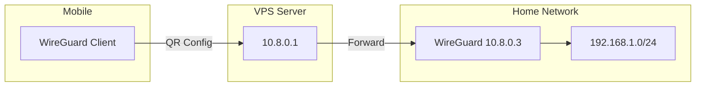

# WireGuard Key Management

This directory stores WireGuard keys and configuration required for secure VPN connectivity between Azure VPS, home cluster, and mobile clients.

## Architecture



## VPS Recreation Scenarios

### Scenario 1: Same Terraform State

When recreating the VPS using the same Terraform state:

1. WireGuard server keys are preserved
2. Home cluster configuration is automatically applied
3. Mobile clients require reconfiguration with new VPS IP

### Scenario 2: New Terraform State/Keys

When recreating VPS with new Terraform state or keys:

1. SSH to the new VPS:

   ```bash
   ssh azureuser@<vps_ip>
   ```

2. Retrieve the server public key:

   ```bash
   sudo cat /etc/wireguard/server.pub
   ```

3. Update the local key file:

   ```bash
   echo "<vps_public_key>" > server_public.key
   ```

4. Update the home cluster configuration with new VPS IP and key

## Mobile Client Configuration

Mobile clients can be configured by:

1. SSH to the VPS:

   ```bash
   ssh azureuser@<vps_ip>
   ```

2. Display the QR code for scanning:

   ```bash
   sudo /usr/local/bin/show-qr
   ```

3. On mobile device, scan QR code with WireGuard app

## Verification

After configuration changes:

1. Test connectivity from mobile to VPS:

   ```bash
   ping 10.8.0.1
   ```

2. Test connectivity to home resources:

   ```bash
   ping 192.168.1.122
   ```

3. Verify WireGuard status on VPS:

   ```bash
   sudo wg show
   ```
